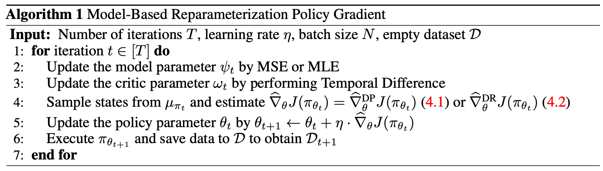

# Model-Based Reparameterization Policy Gradient Methods

Code for [Model-Based Reparameterization Policy Gradient Methods: Theory and Practical Algorithms](https://neurips.cc/virtual/2023/poster/71140). Paper accepted at NeurIPS 2023!

Authors: [Shenao Zhang](https://shenao-zhang.github.io), [Boyi Liu](https://scholar.google.com/citations?user=1G8RH_YAAAAJ&hl=en), [Zhaoran Wang](https://zhaoranwang.github.io)&ast; , [Tuo Zhao](https://www2.isye.gatech.edu/~tzhao80/)&ast;  (&ast; indicates equal advising)



## Installation
The code can be set up by:

```
git clone https://github.com/agentification/RP_PGM.git
cd RP_PGM
python setup.py develop
```

## Basic Example

After setup, the following example can be run to train ``RP-DP-SN`` in the ant environment.

```
python train.py env=mbpo_ant device=cuda:0 seed=0 
```

To train in other environments, change the ``env`` argument to the ones in ``./config/env``. Our code is adapted from the [repository](https://github.com/facebookresearch/svg) of the ``SVG-SAC`` algorithm.
